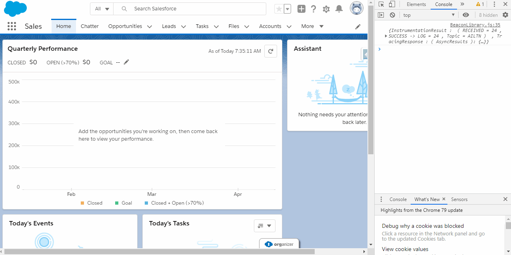

# Lightning Components for List View Custom Actions

Salesforce's List views are a powerful tool to help users organize and navigate to records. Unfortunately, the only actions they support are the standard Edit Delete, and Change Owner.
While it is impossible to add actions to this list, we can be clever and expose custom actions using Formula Fields and Lightning Components.

## Step 1: Create Lightning Component

Create a component you want and make it implement the lightning:isUrlAddressable interface. In this project, the component we are using is the Aura Component called 'myComponent'.

## Step 2: Create a Hyperlink Formula field on Account.

This formula will format the URL for the component mentioned above and pass the record Id as a parameter to the component itself. In this project, the formula field is on Account and is called 'Action'.

## Step 3: Add Formula Field to List View.

Add this formula field to a list view. Typically you would want to put this in the right-most column in the list view so it is next to the actions drop down.

# Component Use

Now you can do whatever you need to do with your component and the record Id passed to it - in this scenario, we are just logging it to the console.

